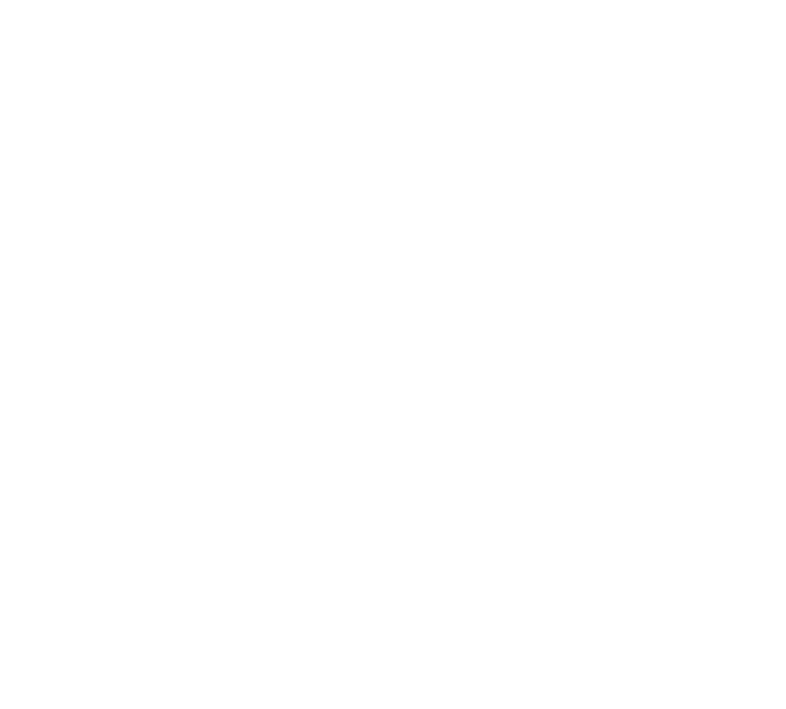

<p align="center">
  <a></a>
</p>


  <p align="center">A unique Video Stream Application</p>
    <p align="center">


## Description

[Vidoos] Video Stream App made on [NestJS](https://github.com/nestjs/nest) framework

## Project setup

```bash
$ npm install
```

## Compile and run the project

```bash
# development
$ npm run start

# watch mode
$ npm run start:dev

# production mode
$ npm run start:prod
```

## Run tests

```bash
# unit tests
$ npm run test

# e2e tests
$ npm run test:e2e

# test coverage
$ npm run test:cov
```

## Resources


- Visit the [NestJS Documentation](https://docs.nestjs.com) to learn more about the framework.
- For questions and support, please visit our [Discord channel](https://discord.gg/).
- To stay in the loop and get updates, follow us on [X](https://x.com/) and [LinkedIn](https://linkedin.com/).
- Application based on [Fullstack app tutuorial](https://blog.logrocket.com/full-stack-app-tutorial-nestjs-react/)


## Support

Nest is an MIT-licensed open source project. It can grow thanks to the sponsors and support by the amazing backers. If you'd like to join them, please [read more here](https://docs.nestjs.com/support).

## Stay in touch


- WhatsApp - []
- Telegram - [](https://t.me/buuuumba)

## License

Nest is [MIT licensed](https://github.com/nestjs/nest/blob/master/LICENSE).
